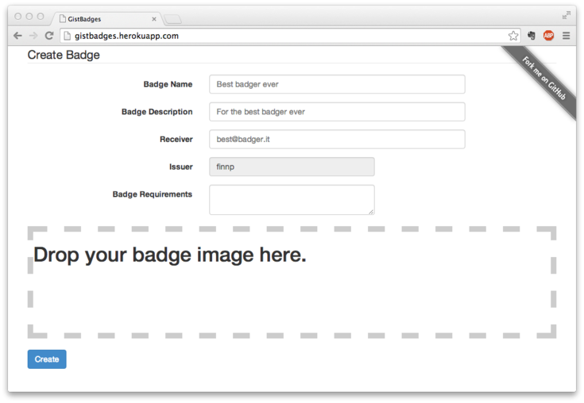

# GistBadges 


Log in with GitHub to issue a [Open Badge](http://www.openbadges.org/) to someone else. 
The badge assertion will be hosted on GitHub Gist and you will get a link to 
send to the person receiving the badge. All you need is a PNG image for the
badge and you are ready to get started.



## Issue workflow

Let's people issue badges to other people like this:

1. Log in with GitHub
2. Input badge data and upload an image
3. Click create and a GitHub Gist is created
4. Receive a link for sharing the Badge
5. The link allows the receiver to save the badge directly to the backback
6. (ノ・∀・)ノ Successfully issued a badge! 

## Install

First install the dependencies, this will also install bower
and run `bower install`.

```
git clone https://github.com/finnp/gistbadges.git
cd gistbadges
npm install
```

Now set the env variables GITHUB_CLIENT and GITHUB_SECRET to 
working values and rum `npm start`. By default it will run
on `localhost:8000`.

## License

The MIT License (MIT)

Copyright (c) 2014 Finn Pauls

Permission is hereby granted, free of charge, to any person obtaining a copy
of this software and associated documentation files (the "Software"), to deal
in the Software without restriction, including without limitation the rights
to use, copy, modify, merge, publish, distribute, sublicense, and/or sell
copies of the Software, and to permit persons to whom the Software is
furnished to do so, subject to the following conditions:

The above copyright notice and this permission notice shall be included in
all copies or substantial portions of the Software.

THE SOFTWARE IS PROVIDED "AS IS", WITHOUT WARRANTY OF ANY KIND, EXPRESS OR
IMPLIED, INCLUDING BUT NOT LIMITED TO THE WARRANTIES OF MERCHANTABILITY,
FITNESS FOR A PARTICULAR PURPOSE AND NONINFRINGEMENT. IN NO EVENT SHALL THE
AUTHORS OR COPYRIGHT HOLDERS BE LIABLE FOR ANY CLAIM, DAMAGES OR OTHER
LIABILITY, WHETHER IN AN ACTION OF CONTRACT, TORT OR OTHERWISE, ARISING FROM,
OUT OF OR IN CONNECTION WITH THE SOFTWARE OR THE USE OR OTHER DEALINGS IN
THE SOFTWARE.